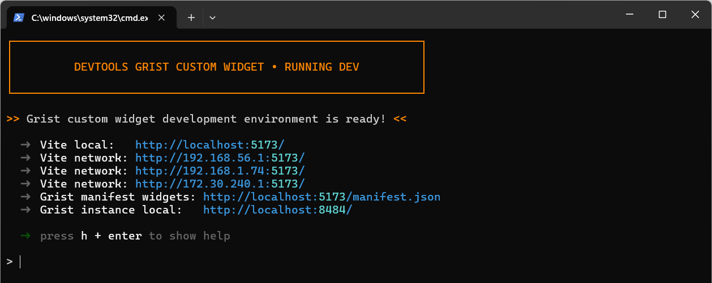
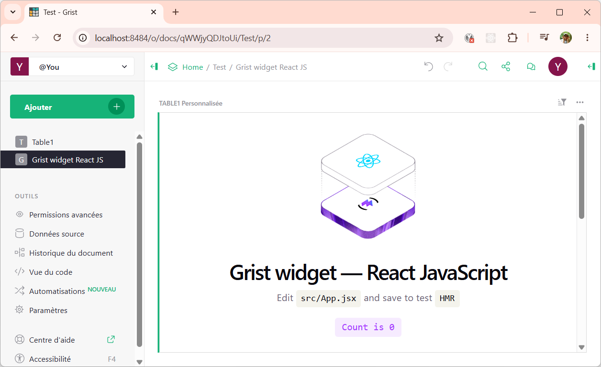

Grist custom widget vite
========================
<small>*Français* | [**English**](./README.md)</small>

> **Templates Vite.js pour la conception de custom widgets Grist.**
>
> Une collection de modèles (React, Vanilla avec ou sans TypeScript...) pour le développement de vos widgets Grist dans l'écosystème [Vite.js](https://vite.dev/).


## Préambule

Ce boilerplate fournit une base robuste pour créer des [Grist custom widgets](https://support.getgrist.com/widget-custom/). En s'appuyant sur Vite.js pour un rechargement à chaud quasi instantané (*Hot Module Replacement* - HMR) et, en option, sur TypeScript pour une sécurité de typage de bout en bout, il garantit une expérience de développement confortable. Il intègre également un environnement Grist conteneurisé (Docker), vous permettant de tester vos widgets localement dans une véritable instance Grist, sans aucune configuration manuelle. L'architecture est très flexible : elle gère automatiquement votre manifeste de widget et prend en charge deux stratégies de construction (Vite standard pour le découpage optimisé des ressources ou SPA (Single Page Application)) selon vos besoins de déploiement.

**Caractéristiques principales :**

* **Environnement clé en main (Zero-Setup)** : Un espace de travail entièrement orchestré et prêt à l'emploi pour les développeurs, comprenant une instance Grist locale conteneurisée via Docker.
* **Plusieurs variantes (Flavors)** : Démarrez votre projet avec votre pile technique préférée, prenant en charge à la fois Vanilla et React, en JavaScript ou en TypeScript.
* **Bundling flexible** : Choisissez votre stratégie de déploiement grâce au support du découpage standard des ressources (*Standard asset splitting*) avec gestion du cache, ou d'un build SPA (*Single Page Application*).
* **Publication automatisée du manifeste de widgets Grist dans le conteneur Docker local** : 
  Lors du lancement de l'environnement de développement, le manifeste est automatiquement déployé et associé à l'instance Docker Grist active.
* **CLI Devtools unifié** : Gérez sans effort le développement local, la compilation de production et la prévisualisation grâce à une application CLI unique offrant des commandes simples (`dev`, `build`, `preview`).


## Démarrage rapide

### Prérequis

Avant de commencer, assurez-vous de disposer des éléments suivants :

 - **Docker** avec **Docker Compose** : >=28.4
 - **Node.js** : ^20.19 ou >=22.12
 - **Gestionnaire de paquets** : pnpm (*recommandé*)

### Échafaudage (Scaffolding) de votre projet de widget Grist

Utilisez [tiged](https://github.com/tiged/tiged) pour cloner instantanément l'un de nos modèles officiels dans votre propre dossier de projet.

```bash
# Initiez votre projet de widget Grist 
npx tiged AOT-DEP-BADI/grist-custom-widget-vite/templates/react mon-widget

# Allez dans le dossier de votre projet
cd mon-widget

# Installez les dépendances
pnpm install

# Lancez l'environnement de développement local
pnpm dev 
```

 <small>— Lancement de l'environnement de développement du widget personnalisé Grist</small>

Et voilà, vous êtes prêt à développer votre widget Grist ! Une fois votre projet créé, vous pouvez utiliser les commandes suivantes :

 - pour démarrer votre environnement de développement local (`pnpm dev`),
 - pour lancer les tests (`pnpm test`),
 - pour compiler le widget Grist pour la production (`pnpm build`),
 - et pour prévisualiser la version de production (`pnpm preview`).


## TL;DR

### Modèles de widgets Grist disponibles

Le projet fournit un ensemble de modèles pour démarrer rapidement le développement de votre widget personnalisé Grist, vous permettant de choisir celui qui vous convient le mieux :

| Modèle de widget Grist | Commande pour créer un nouveau projet |
| --- | --- |
| **React** *(JavaScript)* | `npx tiged AOT-DEP-BADI/grist-custom-widget-vite/templates/react mon-widget` |
| **React** *(TypeScript + React compiler)* | `npx tiged AOT-DEP-BADI/grist-custom-widget-vite/templates/react-ts mon-widget` |
| **Vanilla** *(JavaScript)* | `npx tiged AOT-DEP-BADI/grist-custom-widget-vite/templates/vanilla mon-widget` |
| **Vanilla** *(TypeScript)* | `npx tiged AOT-DEP-BADI/grist-custom-widget-vite/templates/vanilla-ts mon-widget` |

### Démarrer l'environnement de développement Grist local (`pnpm dev`)

1. **Configurez votre widget personnalisé Grist**
   Configurez votre widget en modifiant le fichier `manifest.json`. Cela rendra le widget disponible dans la liste des widgets personnalisés de votre instance locale Grist (Docker). N'oubliez pas de modifier l'identifiant (`widgetId`) de votre widget.
```json
[
  {
    "name": "Startiflette",
    "url": "http://localhost:5173/index.html",
    "widgetId": "@acme/mon-widget",
    "isDevInProgress": true,
    "published": true,
    "accessLevel": "none",
    "renderAfterReady": true,
    "description": "Lorem ipsum dolor sit amet.",
    "isGristLabsMaintained": false,
    "authors": [
      {
        "name": "v20100v",
        "url": "https://github.com/v20100v"
      }
    ]
  }
]
```

2. **Démarrer l'environnement Grist local**
```bash
pnpm dev
```

Cette commande lance un conteneur Docker Grist à l'adresse http://localhost:8484 et un serveur web Vite avec HMR (*Hot Module Replacement*) à l'adresse http://localhost:5173, qui sert également le manifeste du widget à l'adresse http://localhost:5173/manifest.json.
> **Astuces**
> * Pour obtenir des informations plus détaillées lors du démarrage, vous pouvez utiliser le drapeau `--verbose` ou `-v` avec la commande `dev`. Cela est utile pour le dépannage de l'orchestration des conteneurs ou de l'initialisation du serveur.
> * Vous pouvez personnaliser les ports du serveur web Vite et du conteneur Docker Grist en définissant les variables d'environnement `VITE_PORT` and `GRIST_PORT`, ou en utilisant les drapeaux `--vite-port` et `--grist-port`.

3. **Vérifier la disponibilité du manifeste Grist local**.Assurez-vous que votre widget est correctement exposé en consultant le fichier `manifest.json` généré dynamiquement à l'adresse http://localhost:5173/manifest.json.

4. **Utiliser le widget dans l'instance Grist locale**.Une fois l'environnement de dev lancé, ouvrez l'instance Grist locale à l'adresse http://localhost:8484 pour créer un nouveau document et ajouter le widget dans une vue personnalisée.
   <small>— Chargement du widget local dans l'instance Grist locale</small>
   > **Note** : Vous remarquerez que votre widget local est immédiatement accessible dans Grist. Cela se fait automatiquement car le conteneur Docker utilise la variable d'environnement `GRIST_WIDGET_LIST_URL` pour pointer vers votre serveur local. En coulisses, deux plugins Vite dédiés (`generateGristManifestPlugin` et `updateGristManifestDistPlugin`) veillent à ce que votre `manifest.json` soit toujours généré et à jour.


5. Et voici le widget final ! Grâce au HMR (*Hot Module Replacement*) fourni par Vite.js, les modifications de votre code sont répercutées instantanément sans rechargement complet de la page. Contrairement à un Live Reload standard, le HMR ne met à jour que les modules modifiés. Cela préserve l'état et les données actuels de votre widget, garantissant un flux de travail fluide et ultra-rapide.
   <small>— Rendu du widget en temps réel dans Grist avec HMR</small>

Happy coding !

### Compiler votre widget personnalisé Grist pour la production (`pnpm build`)

Le processus dépend du modèle choisi. L'étape de build compile votre code source TypeScript et vos ressources dans un widget prêt pour la production, en optimisant à la fois les performances et la compatibilité. Elle s'appuie sur Vite.js pour le bundling des ressources et sur le compilateur React pour un rendu optimisé. Les fichiers finaux sont organisés dans le dossier `dist/`, prêts à être déployés.

```bash
pnpm build
```

### Prévisualiser le build de production (`pnpm preview`)

Le mode prévisualisation vous permet de tester la version de production de votre widget (les fichiers compilés dans `/dist`) au sein d'une instance Grist active avant le déploiement réel.

```bash
pnpm preview
```

Cette commande orchestre quatre étapes clés :

 - **Build de production** : Déclenche automatiquement une compilation en utilisant les variables d'environnement `NODE_ENV: production` et `PREVIEW_MODE: true` pour s'assurer que vos ressources sont compilées spécifiquement pour l'environnement de prévisualisation.
 - **Serveur de prévisualisation Vite** : Démarre un serveur web local sur le port 4173 (en mode strict) pour servir les fichiers statiques directement depuis le répertoire `dist/v.{x.y.z}/`.
 - **Grist conteneurisé** : Lance un conteneur Grist préconfiguré pour reconnaître automatiquement le manifeste de production stocké dans `dist/v.{x.y.z}/manifest.json`.
 - **Liaison dynamique** : Injecte l'URL du manifeste de production ([http://host.docker.internal:4173/manifest.json](https://www.google.com/search?q=http://host.docker.internal:4173/manifest.json)) dans l'environnement Grist via la variable `GRIST_WIDGET_LIST_URL`, rendant votre widget instantanément disponible dans le catalogue des widgets personnalisés de Grist.


## À propos

### Vous souhaitez contribuer ?

Les idées, les rapports de bugs, les signalements de fautes de frappe dans la documentation, les commentaires, les pull-requests et les étoiles GitHub sont toujours les bienvenus !

### Licence

Publié sous [Licence MIT](https://www.google.com/search?q=./LICENSE),
Copyright (c) 2026 Académie Orléans-Tours, Bureau analyse et développement informatique